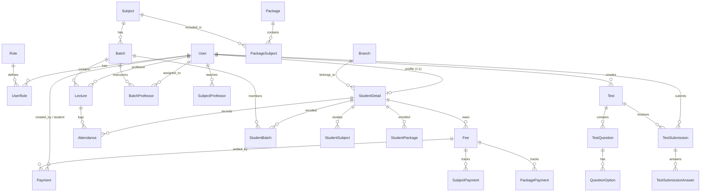

# JKB Backend — API Architecture & Route Documentation

Welcome to the official developer and API documentation for the **JKB Education Group Backend** (`jkb-backend`). This documentation serves as a comprehensive, human-readable reference for backend engineers, frontend developers, DevOps, and QA testers.

---

## 🏛 System Overview & Architecture

The JKB Backend is built with **Node.js**, **Express**, **TypeScript**, and **Prisma ORM**, backed by a **PostgreSQL** database (hosted via Supabase), **Redis** for in-memory caching and session states, **Winston** with daily log rotation for audit trails, **Nodemailer** for email delivery & OTP verification, and Google **Gemini 2.5 Flash API** for AI-driven career and branch recommendations.

```mermaid
graph TD
    Client[Web / Mobile Clients] -->|HTTPS Requests| Server[Express Server (server.ts)]
    Server -->|CORS, CookieParser, JSON Parser| Middlewares[Auth & Role Middlewares]
    Middlewares -->|Protected Handlers| Controllers[Controllers Layer]
    Controllers -->|ORM Queries & Transactions| Prisma[Prisma Client (PostgreSQL)]
    Controllers -->|Status Caching & Timers| Redis[Redis Client]
    Controllers -->|Audit Logs| Winston[Winston Daily Rotate Logger]
    Controllers -->|Email & OTPs| Nodemailer[SMTP / Gmail Service]
    Controllers -->|AI Recommendations| Gemini[Google Gemini AI API]
```

---

## 🚀 Server Entry Point (`src/server.ts`)

- **Entry Point**: [src/server.ts](file:///c:/Users/user/Desktop/jkb-backend/src/server.ts)
- **Port**: Configurable via `process.env.PORT` (defaults to `8000`).
- **Proxy Configuration**: `app.set('trust proxy', 1)` enables reverse-proxy trust for client IP resolution in logging and rate limiting.
- **CORS Configuration**: Dynamic origin evaluation matching comma-separated whitelist in `process.env.HOST_URLS` with `credentials: true`.
- **API Documentation**: Interactive Swagger UI mounted at `/docs` using Swagger OpenAPI 3.0 specs.

---

## 🗺 API Route Mounting Matrix

All core API routes are versioned under `/api/v3`. The table below outlines each route module, its base path in [server.ts](file:///c:/Users/user/Desktop/jkb-backend/src/server.ts), controller source, and documentation link.

| # | Route File | Mount Base URL | Controller(s) | Documentation |
|---|------------|----------------|---------------|---------------|
| 1 | [attendanceRoutes.ts](file:///c:/Users/user/Desktop/jkb-backend/src/routes/attendanceRoutes.ts) | `/api/v3` | [attendanceController.ts](file:///c:/Users/user/Desktop/jkb-backend/src/controllers/attendanceController.ts) | [attendanceRoutes.md](file:///c:/Users/user/Desktop/jkb-backend/docs/attendanceRoutes.md) |
| 2 | [branchRoutes.ts](file:///c:/Users/user/Desktop/jkb-backend/src/routes/branchRoutes.ts) | `/api/v3/admin/branches` | [branchController.ts](file:///c:/Users/user/Desktop/jkb-backend/src/controllers/branchController.ts) | [branchRoutes.md](file:///c:/Users/user/Desktop/jkb-backend/docs/branchRoutes.md) |
| 3 | [coursePackageRoutes.ts](file:///c:/Users/user/Desktop/jkb-backend/src/routes/coursePackageRoutes.ts) | `/api/v3/admin` | [coursePackageController.ts](file:///c:/Users/user/Desktop/jkb-backend/src/controllers/coursePackageController.ts) | [coursePackageRoutes.md](file:///c:/Users/user/Desktop/jkb-backend/docs/coursePackageRoutes.md) |
| 4 | [loginRoutes.ts](file:///c:/Users/user/Desktop/jkb-backend/src/routes/loginRoutes.ts) | `/api/v3/auth` | [loginController.ts](file:///c:/Users/user/Desktop/jkb-backend/src/controllers/loginController.ts), [send_email.ts](file:///c:/Users/user/Desktop/jkb-backend/src/utils/send_email.ts) | [loginRoutes.md](file:///c:/Users/user/Desktop/jkb-backend/docs/loginRoutes.md) |
| 5 | [mhai_routes.ts](file:///c:/Users/user/Desktop/jkb-backend/src/routes/mhai_routes.ts) | `/api/v3` | [mhai_controller.ts](file:///c:/Users/user/Desktop/jkb-backend/src/controllers/mhai_controller.ts) | [mhai_routes.md](file:///c:/Users/user/Desktop/jkb-backend/docs/mhai_routes.md) |
| 6 | [miscellaneousRoutes.ts](file:///c:/Users/user/Desktop/jkb-backend/src/routes/miscellaneousRoutes.ts) | `/api/v3` | [miscellaneousController.ts](file:///c:/Users/user/Desktop/jkb-backend/src/controllers/miscellaneousController.ts) | [miscellaneousRoutes.md](file:///c:/Users/user/Desktop/jkb-backend/docs/miscellaneousRoutes.md) |
| 7 | [paymentRoutes.ts](file:///c:/Users/user/Desktop/jkb-backend/src/routes/paymentRoutes.ts) | `/api/v3` | [paymentController.ts](file:///c:/Users/user/Desktop/jkb-backend/src/controllers/paymentController.ts) | [paymentRoutes.md](file:///c:/Users/user/Desktop/jkb-backend/docs/paymentRoutes.md) |
| 8 | [predictRoutes.ts](file:///c:/Users/user/Desktop/jkb-backend/src/routes/predictRoutes.ts) | Unmounted (Legacy) | Legacy stub handlers | [predictRoutes.md](file:///c:/Users/user/Desktop/jkb-backend/docs/predictRoutes.md) |
| 9 | [productRoutes.ts](file:///c:/Users/user/Desktop/jkb-backend/src/routes/productRoutes.ts) | `/api/v3/api/products` | [batchController.ts](file:///c:/Users/user/Desktop/jkb-backend/src/controllers/batchController.ts) | [productRoutes.md](file:///c:/Users/user/Desktop/jkb-backend/docs/productRoutes.md) |
| 10 | [professorRoutes.ts](file:///c:/Users/user/Desktop/jkb-backend/src/routes/professorRoutes.ts) | `/api/v3/professor` | [professorController.ts](file:///c:/Users/user/Desktop/jkb-backend/src/controllers/professorController.ts), [batchController.ts](file:///c:/Users/user/Desktop/jkb-backend/src/controllers/batchController.ts) | [professorRoutes.md](file:///c:/Users/user/Desktop/jkb-backend/docs/professorRoutes.md) |
| 11 | [roleRoutes.ts](file:///c:/Users/user/Desktop/jkb-backend/src/routes/roleRoutes.ts) | `/api/v3/auth` | [roleController.ts](file:///c:/Users/user/Desktop/jkb-backend/src/controllers/roleController.ts) | [roleRoutes.md](file:///c:/Users/user/Desktop/jkb-backend/docs/roleRoutes.md) |
| 12 | [studentDetailsRoutes.ts](file:///c:/Users/user/Desktop/jkb-backend/src/routes/studentDetailsRoutes.ts) | `/api/v3/student-details` | [studentDetailsController.ts](file:///c:/Users/user/Desktop/jkb-backend/src/controllers/studentDetailsController.ts) | [studentDetailsRoutes.md](file:///c:/Users/user/Desktop/jkb-backend/docs/studentDetailsRoutes.md) |
| 13 | [subjectRoutes.ts](file:///c:/Users/user/Desktop/jkb-backend/src/routes/subjectRoutes.ts) | `/api/v3/admin` | [subjectController.ts](file:///c:/Users/user/Desktop/jkb-backend/src/controllers/subjectController.ts) | [subjectRoutes.md](file:///c:/Users/user/Desktop/jkb-backend/docs/subjectRoutes.md) |
| 14 | [testRoutes.ts](file:///c:/Users/user/Desktop/jkb-backend/src/routes/testRoutes.ts) | `/api/v3/` | [testController.ts](file:///c:/Users/user/Desktop/jkb-backend/src/controllers/testController.ts) | [testRoutes.md](file:///c:/Users/user/Desktop/jkb-backend/docs/testRoutes.md) |
| 15 | [userRoutes.ts](file:///c:/Users/user/Desktop/jkb-backend/src/routes/userRoutes.ts) | `/api/v3/auth/users` | [userController.ts](file:///c:/Users/user/Desktop/jkb-backend/src/controllers/userController.ts) | [userRoutes.md](file:///c:/Users/user/Desktop/jkb-backend/docs/userRoutes.md) |

---

## 🔐 Authentication & Authorization Architecture

### 1. Token Specification
- **Algorithm**: HS256 (defined by `process.env.ALGORITHM` in [consts.ts](file:///c:/Users/user/Desktop/jkb-backend/src/utils/consts.ts)).
- **Secret**: `process.env.SECRET_KEY`.
- **Expiration**: Defaults to 30 minutes in [jwt_token.ts](file:///c:/Users/user/Desktop/jkb-backend/src/utils/jwt_token.ts), while [loginController.ts](file:///c:/Users/user/Desktop/jkb-backend/src/controllers/loginController.ts) generates 24-hour access tokens (`ACCESS_TOKEN_EXPIRE_MINUTES = 86400`).
- **Payload Schema (`TokenPayload`)**:
  ```typescript
  export interface TokenPayload {
    user_id: string;   // UUID of the User record in database
    role_name: string; // 'student' | 'professor' | 'admin' | 'super_admin'
  }
  ```

### 2. Middleware Chain ([src/middlewares/authMiddleware.ts](file:///c:/Users/user/Desktop/jkb-backend/src/middlewares/authMiddleware.ts))
1. `authMiddleware`:
   - Inspects `Authorization: Bearer <token>` HTTP header.
   - Verifies cryptographic signature and decodes payload into `req.user`.
   - Rejects missing headers with `401 Unauthorized` and expired/malformed tokens with `403 Forbidden`.
2. `authorizeRoles(allowedRoles: string[])`:
   - Grants automatic access to `super_admin` (`SUPER_ADMIN_ROLE`).
   - Checks if `req.user.role_name` exists within `allowedRoles`.
   - Rejects unauthorized callers with `403 Forbidden`.

### 3. Role Hierarchy & Primary Capabilities
```
                 ┌─────────────────┐
                 │   super_admin   │ (Full system bypass & management)
                 └────────┬────────┘
                          │
          ┌───────────────┴───────────────┐
          ▼                               ▼
    ┌───────────┐                   ┌───────────┐
    │   admin   │                   │ professor │
    └─────┬─────┘                   └─────┬─────┘
          │ (CRUD packages, fees,         │ (Manages assigned lectures,
          │  branches, subjects,          │  batches, tests & marks
          │  students, payments)          │  attendance)
          │                               │
          └───────────────┬───────────────┘
                          ▼
                    ┌───────────┐
                    │  student  │ (Views enrolled batches, tests,
                    └───────────┘  submits MCQs, pays fees)
```

---

## 🗄 Prisma Data Models & Core Relationships

Located in [prisma/schema.prisma](file:///c:/Users/user/Desktop/jkb-backend/prisma/schema.prisma):



---

## 📦 Global Utilities, Constants & Shared Services

### 1. Common Response Formatters ([src/utils/common_funcs.ts](file:///c:/Users/user/Desktop/jkb-backend/src/utils/common_funcs.ts))
- **`successJson(message: string, result: any)`**: Returns `{ success: true, message, result }`.
- **`errorJson(message: string, error: any)`**: Returns `{ success: false, message, error }`.
- **`generateOTP(length: number = 4)`**: Cryptographic numerical OTP generator.

### 2. System Constants & HTTP Status Codes ([src/utils/consts.ts](file:///c:/Users/user/Desktop/jkb-backend/src/utils/consts.ts))
- `STATUS_CODES`:
  - `CREATE_SUCCESS: 201`, `CREATE_FAILURE: 500`
  - `SELECT_SUCCESS: 200`, `SELECT_FAILURE: 404`
  - `UPDATE_SUCCESS: 200`, `UPDATE_FAILURE: 500`
  - `DELETE_SUCCESS: 200`, `DELETE_FAILURE: 500`
  - `BAD_REQUEST: 400`, `FORBIDDEN_REQUEST: 403`, `UNAUTHORIZED: 401`
- `TZ_INDIA`: `'Asia/Kolkata'` timezone for financial and timestamp operations.
- `SALT: 10`: Bcrypt password hashing salt rounds.
- `ATTENDANCE_WAIT_TIME: 2`: Minimum wait time (in minutes) required between sequential attendance marking submissions.

### 3. Audit Logging System ([src/logging/logger.ts](file:///c:/Users/user/Desktop/jkb-backend/src/logging/logger.ts))
- Configured using **Winston** and **winston-daily-rotate-file**.
- Writes compressed daily log files to `logs/auth-%DATE%.log` with max size `5MB`.
- Logs structured events: `USER_LOGIN_SUCCESS`, `USER_CREATED`, `USER_DELETED`, etc., containing user ID, email, role, and client IP.

### 4. Redis Client ([src/utils/redisClient.ts](file:///c:/Users/user/Desktop/jkb-backend/src/utils/redisClient.ts))
- Used for caching active test statuses and session countdowns.
- Automatic connection handling with graceful fallbacks if the Redis daemon is offline.

### 5. Email & Notification Subsystem ([src/utils/send_email.ts](file:///c:/Users/user/Desktop/jkb-backend/src/utils/send_email.ts))
- Configured with **Nodemailer** over SMTP port `587` or `465`.
- Handles password reset OTP generation, email dispatching, OTP verification, and markdown-rendered AI career prediction reports.

---
