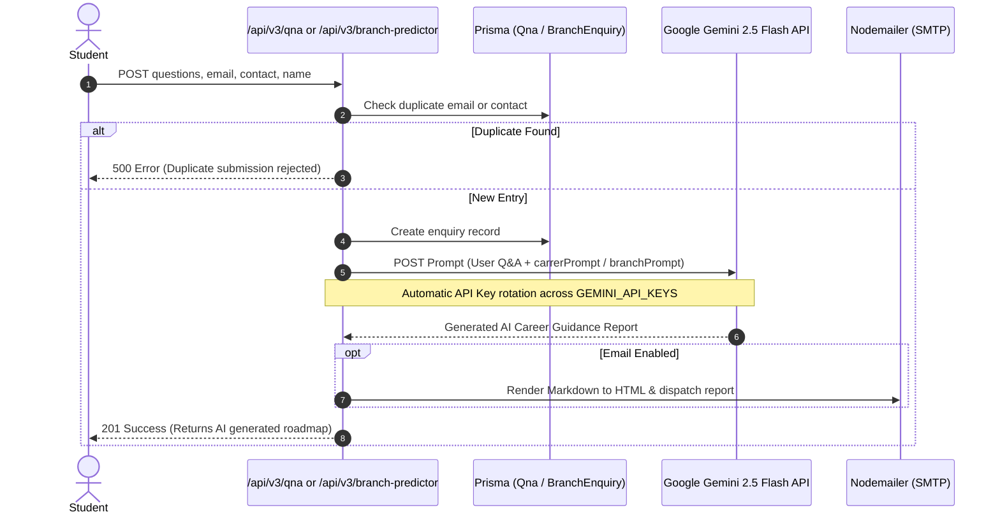

# Miscellaneous, AI Predictions & Lead Generation API Documentation

- **Route Source**: [src/routes/miscellaneousRoutes.ts](file:///c:/Users/user/Desktop/jkb-backend/src/routes/miscellaneousRoutes.ts)
- **Controller Source**: [src/controllers/miscellaneousController.ts](file:///c:/Users/user/Desktop/jkb-backend/src/controllers/miscellaneousController.ts)
- **Prompt Source**: [src/utils/prompts.ts](file:///c:/Users/user/Desktop/jkb-backend/src/utils/prompts.ts)
- **Mount Point**: `/api/v3` in [src/server.ts](file:///c:/Users/user/Desktop/jkb-backend/src/server.ts#L70)
- **Primary Database Models**: `Qna`, `BranchEnquiry`, `ContactEnquiry`, `FacebookEnquiry`, `Lead`

---

## 🎯 Overview & AI Integration Architecture

This module manages public student counseling enquiries, social media lead capture, contact submissions, and Google **Gemini 2.5 Flash** AI career & engineering branch recommendation pipelines.



---

## 🔐 Access Control Matrix

| Endpoint | HTTP Method | Full Path | Auth Required | Allowed Roles |
|---|---|---|---|---|
| Submit Q&A Career Assessment | `POST` | `/api/v3/qna` | No (Public) | Anyone |
| Get All Q&A Enquiries | `GET` | `/api/v3/admin/qna-enquiries` | Yes | `admin`, `super_admin` |
| Submit Contact Enquiry | `POST` | `/api/v3/contact-enquiries` | No (Public) | Anyone |
| Get Contact Enquiries | `GET` | `/api/v3/admin/contact-enquiries` | Yes | `admin`, `super_admin` |
| Submit Branch Predictor Q&A | `POST` | `/api/v3/branch-predictor` | No (Public) | Anyone |
| Get Branch Enquiries | `GET` | `/api/v3/admin/branch-enquiries` | Yes | `admin`, `super_admin` |
| Capture Marketing Lead | `POST` | `/api/v3/leads` | No (Public) | Anyone |
| Get All Captured Leads | `GET` | `/api/v3/leads` | Yes | `admin`, `super_admin` |
| Submit Facebook Enquiry | `POST` | `/api/v3/facebook-enquiries` | No (Public) | Anyone |
| Get Facebook Enquiries | `GET` | `/api/v3/admin/facebook-enquiries` | Yes | `admin`, `super_admin` |

---

## 📡 Endpoint Specifications

### 1. Submit Career Prediction Assessment (`/qna`)
Accepts the user's answers to career assessment questions, verifies email format, checks for duplicates in `Qna`, stores the submission, and queries Gemini 2.5 Flash.

- **HTTP Method**: `POST`
- **Path**: `/api/v3/qna`
- **Auth**: None (Public)
- **Request Body (`QnaFormResponse`)**:
```json
{
  "name": "Aarav Sharma",
  "email": "aarav.sharma@gmail.com",
  "contact": "9820012345",
  "address": "Andheri West, Mumbai",
  "questions": {
    "q1": "I like solving algorithmic puzzles and building software",
    "q2": "Prefer office research and high compensation",
    "q3": "Interested in Artificial Intelligence in India"
  }
}
```

#### Evaluation & AI Flow
1. Validates email regex (`/^[a-zA-Z0-9._%+-]+@[a-zA-Z0-9.-]+\.[a-zA-Z]{2,}$/`).
2. Checks if an enquiry with the same `email` or `contact` already exists in `Qna`. If so, rejects with HTTP 500 (`CREATE_FAILURE`).
3. Saves the record to `prismaClient.qna`.
4. Appends system prompt `carrerPrompt` from [src/utils/prompts.ts](file:///c:/Users/user/Desktop/jkb-backend/src/utils/prompts.ts#L1).
5. Dispatches request to Gemini Flash endpoint with automatic retry across `GEMINI_API_KEYS`.
6. Returns the markdown response.

#### Response (201 Created)
```json
{
  "success": true,
  "message": "User Enquiry created successfully and Recieved Gemini Response!",
  "result": "### Best Career Option: AI/ML Engineering\n\n**Industry Overview in India:** ..."
}
```

---

### 2. Get Admin Q&A Enquiries (`/admin/qna-enquiries`)
Supports pagination via `limit` and `offset` query parameters.

- **HTTP Method**: `GET`
- **Path**: `/api/v3/admin/qna-enquiries`
- **Auth**: Required (`admin`, `super_admin`)
- **Query Parameters**:
  - `limit` (string, optional): Number of rows to take.
  - `offset` (string, optional): Number of rows to skip.
- **Response (200 OK)**:
```json
{
  "success": true,
  "message": "Qna Fetched Successfully!",
  "result": [
    {
      "id": "27845341-9457-4bf7-a3a8-48b049d506ec",
      "full_name": "Aarav Sharma",
      "contact": "9820012345",
      "email": "aarav.sharma@gmail.com",
      "location": "Mumbai",
      "created_at": "2026-03-20T11:00:00.000Z"
    }
  ]
}
```

---

### 3. Engineering Branch Predictor (`/branch-predictor`)
Evaluates 12 specific dimensions (e.g. onsite vs office, single-track vs evolving, remote vs travel, money vs value-addition) and returns the best engineering stream.

- **HTTP Method**: `POST`
- **Path**: `/api/v3/branch-predictor`
- **Auth**: None (Public)
- **Request Body (`BranchFormResponse`)**:
```json
{
  "name": "Neha Joshi",
  "email": "neha.j@gmail.com",
  "contact": "9820054321",
  "address": "Shivaji Nagar, Pune",
  "branch_qna": {
    "interest": "Hardware robotics and IoT circuits",
    "work_preference": "Onsite manufacturing lab"
  }
}
```
- **Response (201 Created)**: Returns AI generated branch recommendation based on `branchPrompt`.

---

### 4. Lead Capture (`/leads`)
Captures marketing leads across social platforms (Instagram, LinkedIn, Facebook, Referral, Website).

- **HTTP Method**: `POST`
- **Path**: `/api/v3/leads`
- **Auth**: None (Public)
- **Request Body (`LeadReqBody`)**:
```json
{
  "name": "Karan Singhania",
  "email": "karan@singhania.com",
  "phone": "+91 9988776655",
  "socialUsername": "@karan_tech",
  "source": "instagram",
  "message": "Interested in Crash Course for MHT-CET 2026"
}
```
- **Response (201 Created)**: Returns created lead with generated cuid.

---

### 5. Contact & Facebook Enquiries
- `POST /api/v3/contact-enquiries` & `GET /api/v3/admin/contact-enquiries`
- `POST /api/v3/facebook-enquiries` & `GET /api/v3/admin/facebook-enquiries`
- Both support duplicate contact number enforcement and paginated administrative viewing.
