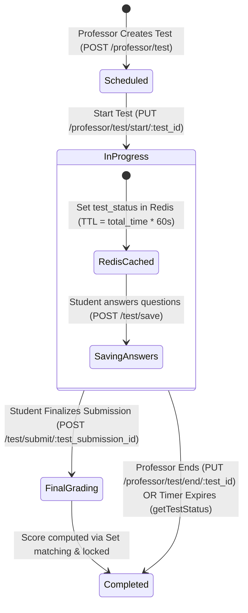

# Online Examination, Questions & MCQ Submission Lifecycle API Documentation

- **Route Source**: [src/routes/testRoutes.ts](file:///c:/Users/user/Desktop/jkb-backend/src/routes/testRoutes.ts)
- **Controller Source**: [src/controllers/testController.ts](file:///c:/Users/user/Desktop/jkb-backend/src/controllers/testController.ts)
- **Mount Point**: `/api/v3/` in [src/server.ts](file:///c:/Users/user/Desktop/jkb-backend/src/server.ts#L67)
- **Primary Database Models**: `Test`, `TestQuestion`, `QuestionOption`, `TestSubmission`, `TestSubmissionAnswer`, `Subject`, `User`
- **Cache Layer**: Redis (`redisClient`) for instant high-concurrency test status validation.

---

## 🎯 Overview & Examination Lifecycle



---

## 🔐 Access Control Matrix

| Action / Route | HTTP Method | Path | Allowed Roles |
|---|---|---|---|
| Get Subject Tests | `GET` | `/api/v3/subject/tests` | `admin`, `professor`, `student`, `super_admin` |
| Get Professor Created Tests | `GET` | `/api/v3/professor/tests` | `admin`, `professor`, `super_admin` |
| Get Real-Time Test Status | `GET` | `/api/v3/professor/test/status/:test_id` | `admin`, `professor`, `student`, `super_admin` |
| Create Test | `POST` | `/api/v3/professor/test` | `admin`, `professor`, `super_admin` |
| Update Test Config | `PUT` | `/api/v3/professor/test/:test_id` | `admin`, `professor`, `super_admin` |
| Start Test | `PUT` | `/api/v3/professor/test/start/:test_id` | `admin`, `professor`, `super_admin` |
| End Test (Force Complete) | `PUT` | `/api/v3/professor/test/end/:test_id` | `admin`, `professor`, `super_admin` |
| Delete Test | `DELETE` | `/api/v3/professor/tests/:test_id` | `admin`, `professor`, `super_admin` |
| Get Test Questions & Options | `GET` | `/api/v3/test/:test_id/questions` | `admin`, `professor`, `student`, `super_admin` |
| Create Question with Options | `POST` | `/api/v3/test/questions` | `admin`, `professor`, `super_admin` |
| Update Question & Options | `PUT` | `/api/v3/test/questions/:question_id` | `admin`, `professor`, `super_admin` |
| Delete Question | `DELETE` | `/api/v3/test/questions/:question_id` | `admin`, `professor`, `super_admin` |
| Get All Student Submissions | `GET` | `/api/v3/test/:test_id/submissions` | `admin`, `professor`, `super_admin` |
| Save Student Answers (Live) | `POST` | `/api/v3/test/save` | `admin`, `professor`, `student`, `super_admin` |
| Finalize & Submit Test | `POST` | `/api/v3/test/submit/:test_submission_id` | `admin`, `professor`, `student`, `super_admin` |
| Get Student Score | `GET` | `/api/v3/test/score` | `admin`, `professor`, `student`, `super_admin` |

---

## 📡 Endpoint Specifications

### 1. Get Subject Tests (`GET /subject/tests`)
Returns all tests for a subject that are NOT `Scheduled`. Includes the user's own submission data.

- **Query Parameters**: `subject_id` (required), `user_id` (required).

#### Prisma Select Clause
```typescript
prismaClient.test.findMany({
  where: { subject_id, test_status: { not: TestStatus.Scheduled } },
  select: {
    id, title, test_status, test_timestamp, total_time,
    testSubmissions: {
      where: { user_id },
      select: { score: true, is_submitted: true }
    }
  }
})
```

#### Response (200 OK)
```json
{
  "success": true,
  "message": "Test fetched Succesfully!",
  "result": [
    {
      "id": "890e3845-f09b-4328-89c0-ec7b4f590011",
      "title": "Data Structures Midterm 2026",
      "test_status": "InProgress",
      "test_timestamp": "2026-04-10T10:00:00.000Z",
      "total_time": 45,
      "testSubmissions": [
        {
          "score": "0.00",
          "is_submitted": false
        }
      ]
    }
  ]
}
```

---

### 2. Get Professor Tests (`GET /professor/tests`)
Returns **full `Test` model** (all fields) for a professor. No nested relations.

- **Query Parameters**: `professor_id` (required).

#### Response (200 OK)
```json
{
  "success": true,
  "message": "Test fetched Succesfully!",
  "result": [
    {
      "id": "890e3845-f09b-4328-89c0-ec7b4f590011",
      "user_id": "f5127025-a128-4f27-a066-70e0f31be4db",
      "subject_id": "3d9c9099-b131-419b-a36c-9418e5e8e811",
      "title": "Data Structures Midterm 2026",
      "test_status": "Scheduled",
      "test_timestamp": "2026-04-10T10:00:00.000Z",
      "total_time": 45,
      "created_at": "2026-04-01T09:00:00.000Z",
      "updated_at": null
    }
  ]
}
```

---

### 3. Create a Test (`POST /professor/test`)
Professor ID is extracted from JWT `req.user.user_id` (passed as `professorId`). Returns the new test `id`.

- **Request Body**:
```json
{
  "title": "Data Structures Midterm Examination 2026",
  "subject_id": "3d9c9099-b131-419b-a36c-9418e5e8e811",
  "start_time": "2026-04-10T10:00:00.000Z",
  "test_duration": 45
}
```
- **Response (201 Created)**: `{ "success": true, "message": "Test created Succesfully", "result": "890e3845-f09b-4328-89c0-ec7b4f590011" }`
- **Error (400 Bad Request)**: `{ "success": false, "message": "Request Body not complete.", "error": null }`
- **Error (400 Bad Request)**: `{ "success": false, "message": "Start time cannot be in the past.", "error": null }`

---

### 4. Update Test (`PUT /professor/test/:test_id`)
Partially updates test fields. All body fields are optional.

- **Request Body**:
```json
{
  "title": "Updated Midterm Title",
  "test_duration": 60,
  "start_time": "2026-04-12T10:00:00.000Z"
}
```
- **Response (200 OK)**: `{ "success": true, "message": "Test Updated Succesfully!", "result": 1 }`

---

### 5. Start a Test (`PUT /professor/test/start/:test_id`)
Sets `test_status = InProgress`, `test_timestamp = new Date()`, and caches in Redis with `EX = total_time * 60`.

- **Response (200 OK)**: `{ "success": true, "message": "Test Started Succesfully!", "result": 1 }`

---

### 6. End a Test (`PUT /professor/test/end/:test_id`)
Force-sets `test_status = Completed`.

- **Response (200 OK)**: `{ "success": true, "message": "Test Ended Succesfully!", "result": 1 }`

---

### 7. Delete a Test (`DELETE /professor/tests/:test_id`)
Cascades deletion of questions and options.

- **Response (200 OK)**: `{ "success": true, "message": "Test Deleted Succesfully!", "result": 1 }`

---

### 8. Get Real-Time Test Status (`GET /professor/test/status/:test_id`)
Queries Redis first; falls back to Prisma on cache miss. If timer expired, auto-transitions to `Completed`.

#### Prisma Select Clause (fallback)
```typescript
prismaClient.test.findUnique({
  where: { id: test_id },
  select: { test_status: true, test_timestamp: true, total_time: true }
})
```

#### Response (200 OK)
```json
{
  "success": true,
  "message": "Test Status fetched successfully!",
  "result": "InProgress"
}
```
Values: `"Scheduled"` | `"InProgress"` | `"Completed"`

---

### 9. Get Questions for a Test (`GET /test/:test_id/questions`)
Strips `is_correct` from all options. Adds a computed `multiple_choice` boolean.

#### Prisma Select Clause
```typescript
prismaClient.testQuestion.findMany({
  where: { test_id: testId },
  select: {
    id, question_text, marks,
    options: { select: { id, option_text } },  // is_correct intentionally excluded
    _count: { select: { options: { where: { is_correct: true } } } }
  }
})
```
`multiple_choice = (_count.options > 1)`

#### Response (200 OK)
```json
{
  "success": true,
  "message": "Quesion and Options fetched Succesfully!",
  "result": [
    {
      "id": "e09a3451-1eb8-490d-95cf-94578b8849b2",
      "question_text": "What is the worst-case time complexity of QuickSort?",
      "marks": 2,
      "multiple_choice": false,
      "options": [
        { "id": "11111111-1111-1111-1111-111111111111", "option_text": "O(N log N)" },
        { "id": "22222222-2222-2222-2222-222222222222", "option_text": "O(N^2)" },
        { "id": "33333333-3333-3333-3333-333333333333", "option_text": "O(N)" }
      ]
    }
  ]
}
```

---

### 10. Create Question with Options (`POST /test/questions`)
Creates `TestQuestion` with nested `QuestionOption` records using `createMany`. Returns `question.id` (from `select: { id: true }`).

- **Request Body**:
```json
{
  "test_id": "890e3845-f09b-4328-89c0-ec7b4f590011",
  "question_text": "What is the worst-case time complexity of QuickSort?",
  "question_marks": "2",
  "options": [
    { "option_text": "O(N log N)", "is_correct": false },
    { "option_text": "O(N^2)", "is_correct": true },
    { "option_text": "O(N)", "is_correct": false }
  ]
}
```
- **Response (201 Created)**: `{ "success": true, "message": "Question and Its Options Created Succesfully!", "result": "question_uuid" }`

---

### 11. Update Question (`PUT /test/questions/:question_id`)
If `options` array is sent: deletes all existing options and recreates them. If `options` is empty/absent: only updates `question_text`/`marks`.

- **Response (200 OK)**: `{ "success": true, "message": "Question updated successfully!", "result": 1 }`

---

### 12. Delete Question (`DELETE /test/questions/:question_id`)
Cascades deletion of related options.

- **Response (200 OK)**: `{ "success": true, "message": "Question and Related options deleted Succesfully!", "result": null }`

---

### 13. Get All Submissions for a Test (`GET /test/:test_id/submissions`)

#### Prisma Select Clause
```typescript
prismaClient.testSubmission.findMany({
  where: { test_id: testId },
  select: {
    id, user_id, score,
    user: { select: { full_name: true } }
  }
})
```

#### Response (200 OK)
```json
{
  "success": true,
  "message": "Test Submission Found Succesfully!",
  "result": [
    {
      "id": "ts-uuid-001",
      "user_id": "8488e001-c887-4eb7-86c0-7612d9198642",
      "score": "18.00",
      "user": {
        "full_name": "Rohan Sharma"
      }
    }
  ]
}
```

---

### 14. Live Save Student Submissions (`POST /test/save`)
Validates test is `InProgress` and within time window. Upserts answers via delete + createMany transaction.

- **Request Body**:
```json
{
  "test_id": "890e3845-f09b-4328-89c0-ec7b4f590011",
  "user_id": "8488e001-c887-4eb7-86c0-7612d9198642",
  "answer": [
    {
      "question_id": "e09a3451-1eb8-490d-95cf-94578b8849b2",
      "selected_option_id": "22222222-2222-2222-2222-222222222222"
    }
  ]
}
```
- **Response (200 OK)**: `{ "success": true, "message": "Test Submission Saved Succesfully!", "result": "test_submission_uuid" }`
- **Error (400 Update Failure)**: `{ "success": false, "message": "Test has not started yet.", "error": null }`
- **Error (400 Update Failure)**: `{ "success": false, "message": "Test is ended, time is over.", "error": null }`
- **Error (400 Update Failure)**: `{ "success": false, "message": "Test is not in progress.", "error": null }`
- **Error (400 Update Failure)**: `{ "success": false, "message": "Submission is already finalized.", "error": null }`

---

### 15. Finalize & Submit Test (`POST /test/submit/:test_submission_id`)
Locks submission, computes score via Set equality, and sets `is_submitted = true`.

- **Response (200 OK)**: `{ "success": true, "message": "Test Submission Ended Succesfully!", "result": 1 }`
- **Error (404 Select Failure)**: `{ "success": false, "message": "No submission of the student found.", "error": null }`

---

### 16. Get Score (`GET /test/score`)
- **Query Parameters**: `test_submission_id` (required), `user_id` (required for student role validation).

#### Prisma Select Clause
```typescript
prismaClient.testSubmission.findUnique({
  where: { id: test_submission_id },
  select: { score: true }
})
```

#### Response (200 OK)
```json
{
  "success": true,
  "message": "Score calculated Succesfully!",
  "result": "18.00"
}
```
- **Error (400 Bad Request)**: `{ "success": false, "message": "Students can only view their own scores.", "error": null }`
- **Error (400 Bad Request)**: `{ "success": false, "message": "Test submission not found.", "error": null }`
